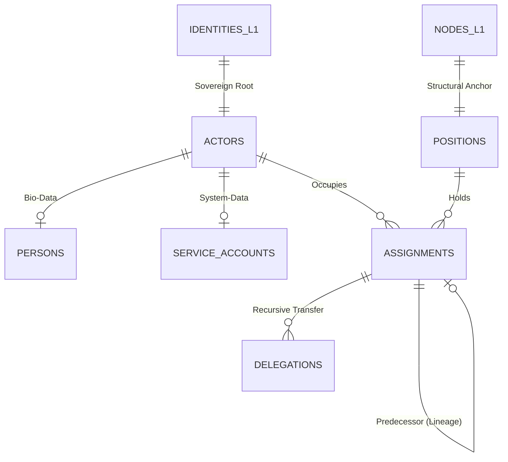

# MJRH V4 — Layer 2 ER Diagram v4.2 (Coherent)

## 3. Cohesion Constants
- `sovereign_root_id`: Present in every table.
- `version`: Sequential BigInt.
- `lifecycle_status`: Enum (DRAFT, ACTIVE, SUSPENDED, ARCHIVED).
