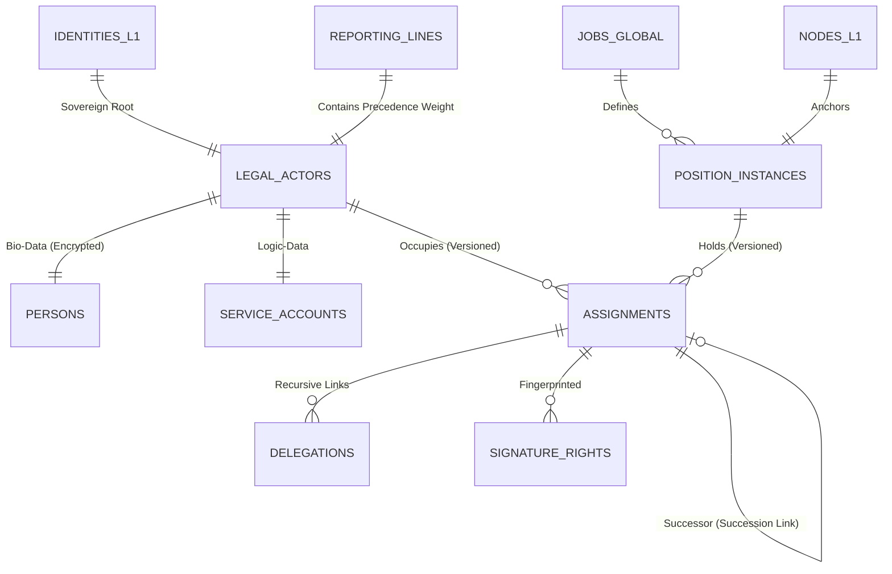

# MJRH V4 — Layer 2 ER Diagram v3.1 (Cohesion Hardened)

## 3. Cohesion Rules
- **[INV_L2_ACCOUNTABILITY]:** Every legal change records the `trace_id` of the governing Policy and the `actor_id`.
- **[INV_L2_SUCCESSION]:** Assignments form an immutable chain via `successor_id`.
