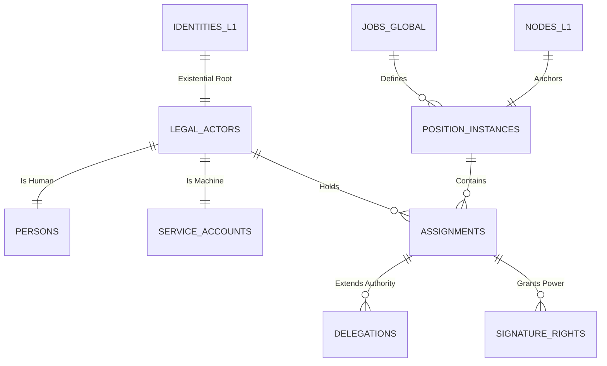

# MJRH V4 — Layer 2 ER Diagram v2.0 (Diamond Grade)

## 3. Integrity Constraints (Final)
- **[INV_L2_ACTOR]:** No mandate can be exercised by an un-anchored actor.
- **[INV_L2_CURRENCY]:** Financial authority is invalid without a matching L1 currency context.
- **[INV_L2_ORDER]:** Sequential signing must follow the `approval_priority` field.
