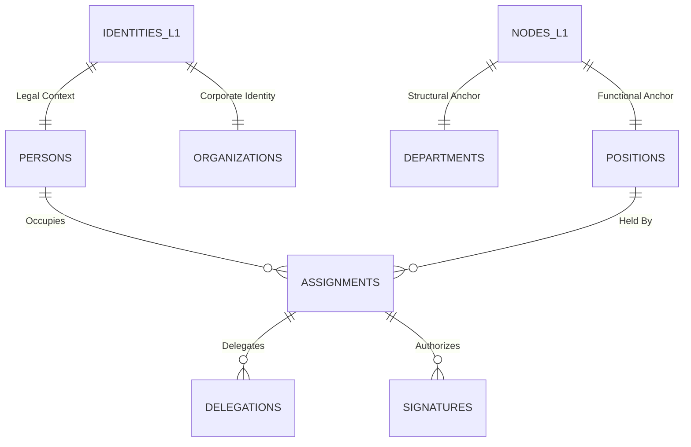

# MJRH V4 — Layer 2 ER Diagram v1.1

```mermaid
erDiagram
    IDENTITIES_L1 ||--|| PERSONS : "Legal Context"
    IDENTITIES_L1 ||--|| ORGANIZATIONS : "Corporate Identity"
    NODES_L1 ||--|| DEPARTMENTS : "Structural Anchor"
    NODES_L1 ||--|| POSITIONS : "Functional Anchor"
    
    PERSONS ||--o{ ASSIGNMENTS : "Occupies"
    POSITIONS ||--o{ ASSIGNMENTS : "Held By"
    
    ASSIGNMENTS ||--o{ DELEGATIONS : "Delegates"
    ASSIGNMENTS ||--o{ SIGNATURES : "Authorizes"
```
