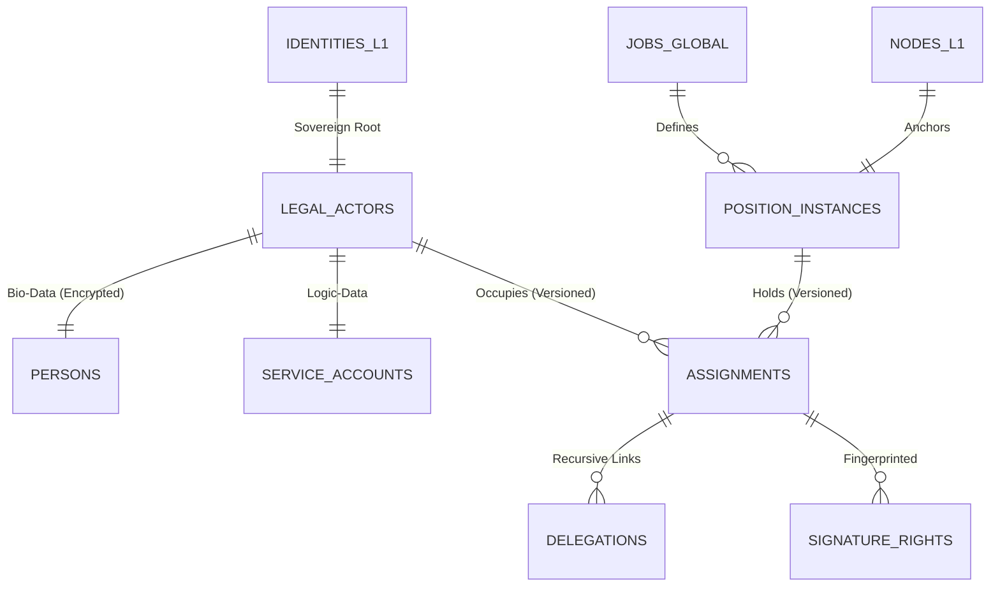

# MJRH V4 — Layer 2 ER Diagram v3.0 (Forensic Grade)

## 3. Advanced Invariants
- **[INV_L2_CHAIN]:** No delegation loop allowed (A->B->C->A is blocked).
- **[INV_L2_CURRENCY]:** Financial limits require a verified Exchange Rate Fact (L3/L5).
- **[INV_L2_ACCOUNTABILITY]:** Every legal change records the `trace_id` of the governing Policy.
