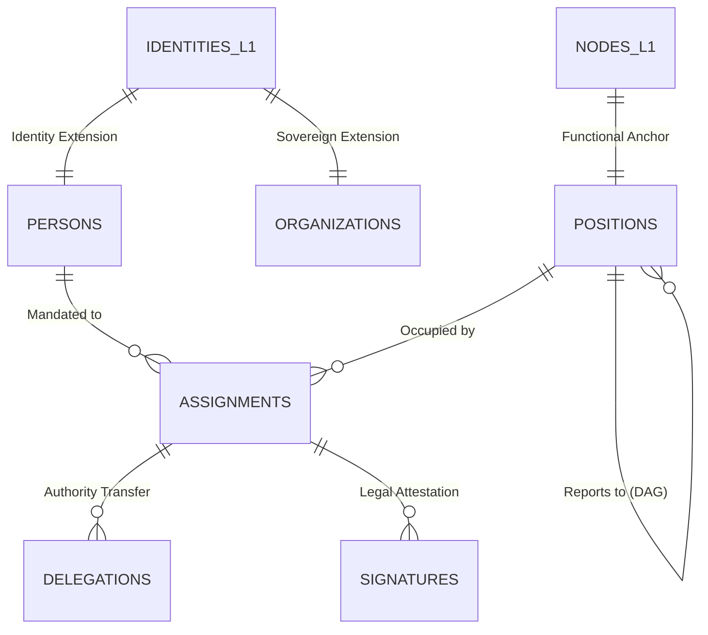

# MJRH V4 — Layer 2 ER Diagram v1.1 (Hardened)

## 1. Physical Relationship Map (Mermaid)

## 2. Integrity Guards (ERD Level)
- **Composite Sovereign Keys:** Every assignment references the Sovereign Root ID from L1 to prevent cross-tenant data bleed.
- **Materialized Chain of Command:** Positions use `ltree` for O(1) reporting line resolution and cycle prevention.
- **Immutable Succession:** The `assignments` table enforces a linked-list pattern for version history.
